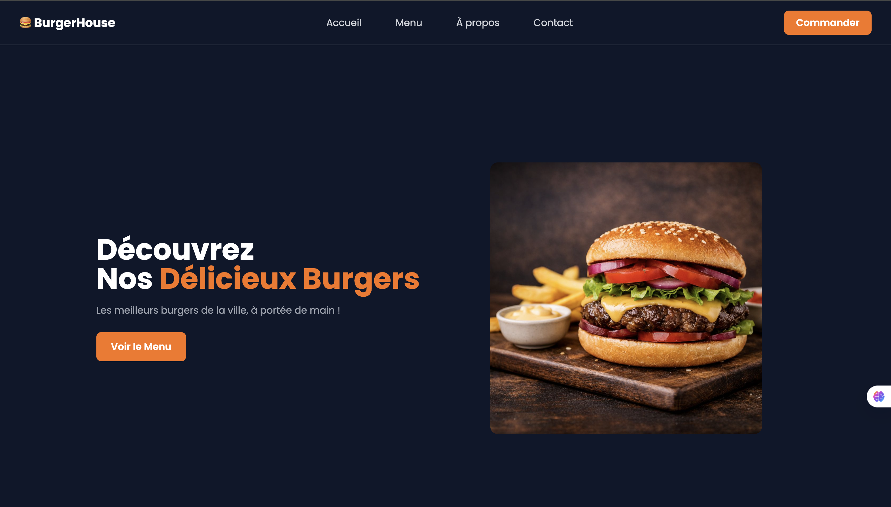

# 🍔 BurgerHouse

Site vitrine pour un restaurant de burgers, avec un design sombre et moderne. Réalisé en HTML et Tailwind CSS.


## 🖼️ Aperçu



## Fonctionnalités

- Header fixe avec navigation, adaptatif mobile/desktop
- Menu mobile déroulant (burger menu) avec animation fluide
- Page d'accueil avec hero, présentation des spécialités
- Page Menu avec cartes produits (burgers) et accompagnements, prix affichés
- Page À propos (histoire, valeurs du restaurant)
- Page Contact avec formulaire et coordonnées
- Police personnalisée (Poppins, via Google Fonts)
- Thème sombre avec accents orange

## Stack technique

- **HTML5** — structure des pages
- **Tailwind CSS** (via CDN) — mise en forme utilitaire
- **JavaScript vanilla** — logique du menu mobile (`toggleMenu()`)
- **Google Fonts** — police Poppins

## 📁 Structure du projet

```
burgerhouse/
├── index.html          # Accueil
├── menu.html           # Menu (burgers + accompagnements)
├── apropos.html        # À propos
├── contact.html        # Contact
├── images/              # Photos des plats, icônes réseaux sociaux
├── LICENSE
└── README.md
```

## Lancer le projet en local

Aucune installation ni dépendance requise : le projet est un ensemble de pages statiques.

1. Clone le dépôt
   ```bash
   git clone https://github.com/veben-cmyk/Burger-site.git
   cd Burger-site
   ```
2. Ouvre `index.html` dans ton navigateur, ou utilise *Live Server* (VS Code) pour le rechargement automatique.

## Workflow Git (Gitflow)

| Branche | Rôle |
|---|---|
| `main` | Code stable, prêt à être déployé/présenté |
| `develop` | Branche d'intégration des nouvelles fonctionnalités |
| `feature/*` | Une branche par fonctionnalité/page |
| `fix/*` | Correction de bug isolée |

Convention de commit : [Conventional Commits](https://www.conventionalcommits.org/) (`feat:`, `fix:`, `docs:`, `style:`...).


## 📌 Améliorations futures

- [ ] Rendre le bouton "Commander" fonctionnel (panier ou lien de commande)
- [ ] Formulaire de contact connecté à un vrai service d'envoi
- [ ] Version anglaise du site

## 👤 Auteur

**Veben Isaac**
- GitHub : [@veben-cmyk](https://github.com/veben-cmyk)
- LinkedIn : [Veben Isaac](https://www.linkedin.com/in/isaac-veben-6ab4093a9/)

## 📄 Licence

Ce projet est sous licence MIT — voir le fichier [LICENSE](LICENSE) pour plus de détails.
